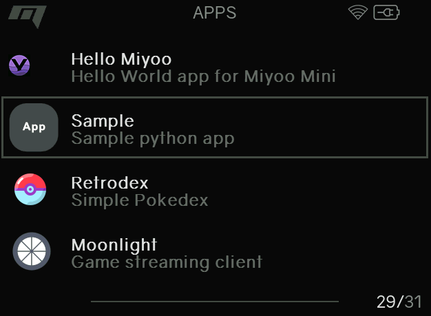
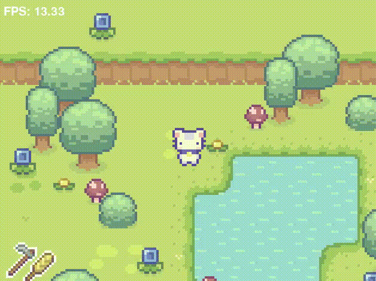

# Miyoo_PydewValley

## Credits
- PyDewValley [Clear Code] - https://www.youtube.com/watch?v=T4IX36sP_0c

- Python example Miyoo - https://github.com/pcorbel/hello-miyoo

## Description
Experiment to develop homebrew game with pygame 2.7 and pygame on miyoo mini plus device
using pytmx version 3.21.7 (source) and six module

## Observations
- Faster to develop than sdl2 but if you blit more fps drops significantly.
- can overclock with "/bin/cpuclock 1800" for more fps (~stable) [Manually set from ssh]
- relative path doesnt work properly [see code]

## How to Run

- Copy "Sample" folder to /mnt/SDCARD/App/ via filezilla or other means

- the app path should be at "/mnt/SDCARD/App/Sample" otherwise it wont work

###Launch

## How to develop

- I have used Ubuntu 20.04 from WSL
- install python2.7 run main.py from code folder [base folder should be code]
- get source for pytmx,six.. [miyoo doesnt have pip to install deps]
- code in wsl and move it to miyoo via filezilla

